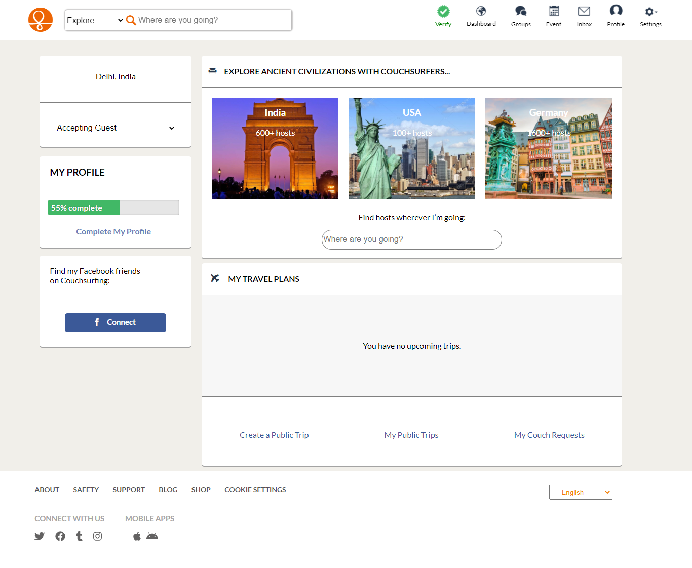
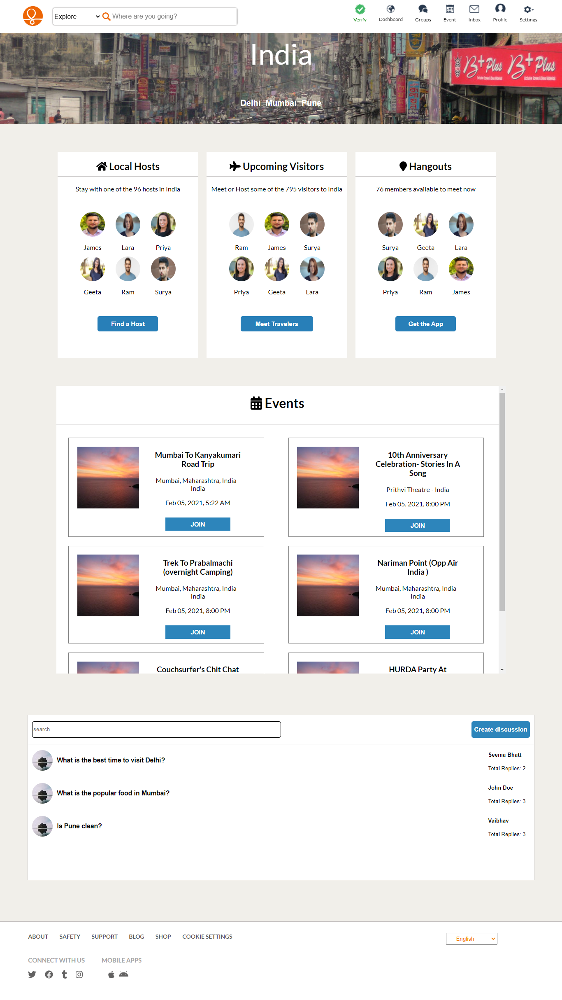
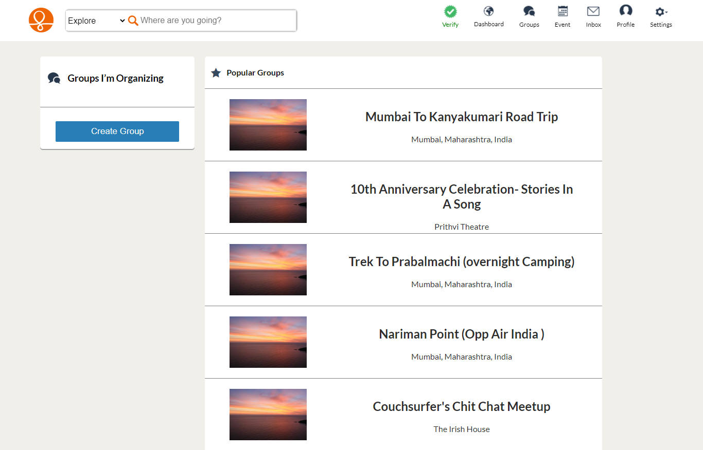
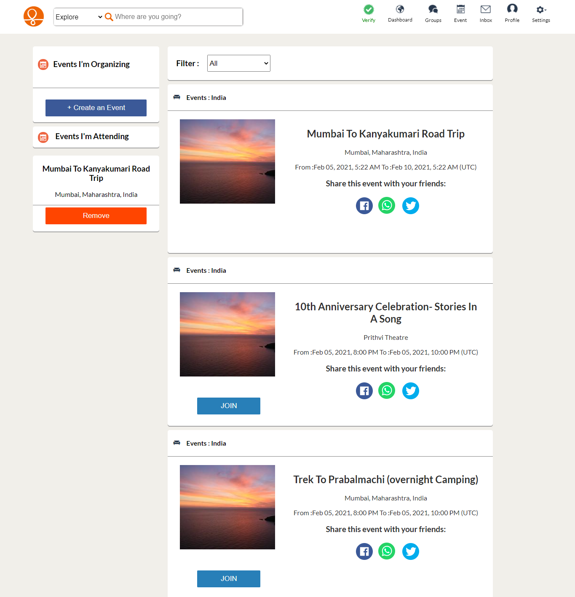
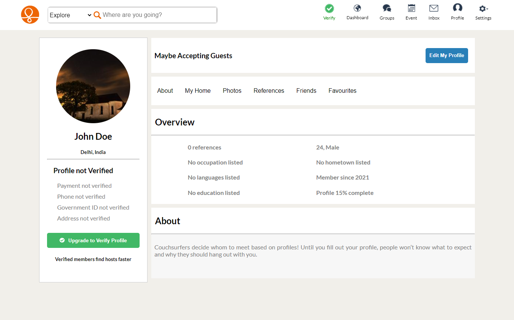

<link rel="stylesheet" href="https://cdn.jsdelivr.net/gh/devicons/devicon@master/devicon.min.css">

# CouchSurfing (clone)🏄🏨

**CouchSurfing** is a global hospitality exchange service accessible via a website and mobile app. Members can request lodging publicly or directly from other members, "hang out" with other members, or join/create events. Harassment is against the terms of service. Members set up user profiles on which other members can post reviews.

In this project we have tried to make a look alike clone of **CouchSurfing**. With our efforts and the technology stack, that we have learned so far in the masai school, we were able to clone the front end with high precision and quality.

# Technology Stack Used 💻

In this project we have used the following tech stack.

- React <i class="devicon-react-plain colored"></i>
- Redux <i class="devicon-redux-plain colored"></i>
- CSS <i class="devicon-css3-plain colored"></i>
- Heroku (for api hosting) <i class="devicon-heroku-plain colored"></i>

Along with that, in order to store user data we also used LocalStorage (aka browser storage).

 

## Libraries Used 🌟

1. font-awesome
2. react-redux
3. react-hook-form
4. uuid
5. redux
6. react-router-dom
7. axios

You can install the libraries using the "**npm install**" command
 

## Snapshots 📷

1. Landing Page
   

2. Login Page
   

3.Dashboard

4. Specific Country Page
   

5. Groups Page
   

6. Events Page
   

7. Profiles Page

    

## End Notes 📑

In this project we were able to achieve a near to perfect clone of the original website. As we do not want to overwhelm you, we haven't shared all the pages here.Please fork the repository and then use it on your own. If you want to collaborate with us on this project then please feel free to reach out to us.

 

## Features

1. User can create an event or a group
2. User can join an event or a group
3. User can interact with other users on the discussion board

 

## Limitations

1. Not responsive yet and might not be properly visible on small screen devices

 

## Team Members and Contributors 😇

👤 **Harsh gaur**

- Github: [iharshgaur](https://github.com/iharshgaur)

👤 **Sahil Raj**

- Github: [sahil2019](sahil2011.raj@gmail.com)

👤 **Arshad Ali**

- Github: [arshadalitalwar](arshadalitalwar@gmail.com)

👤 **Gayathry**

- Github: [Gayathry7](gayathryjm@gmail.com)
